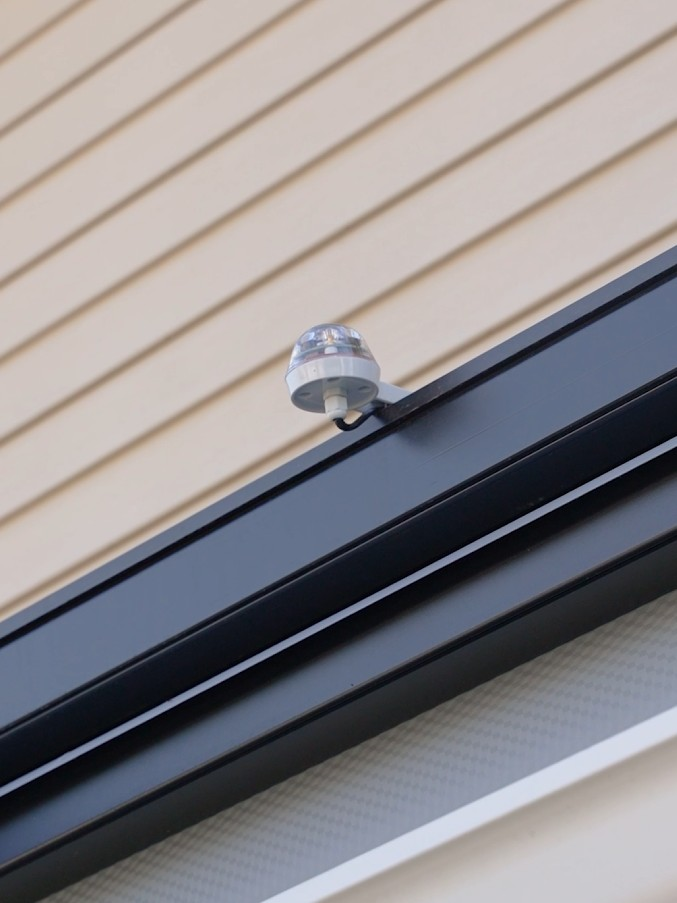
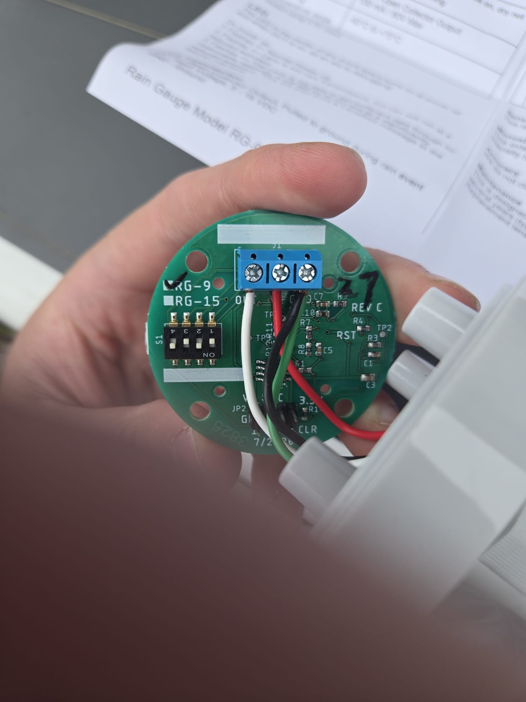
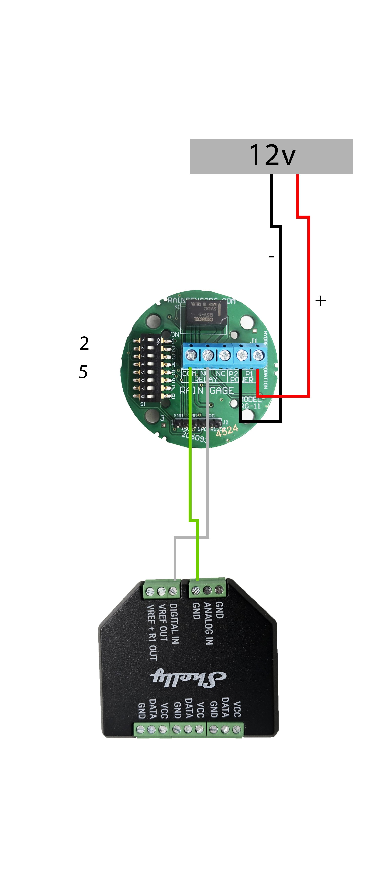
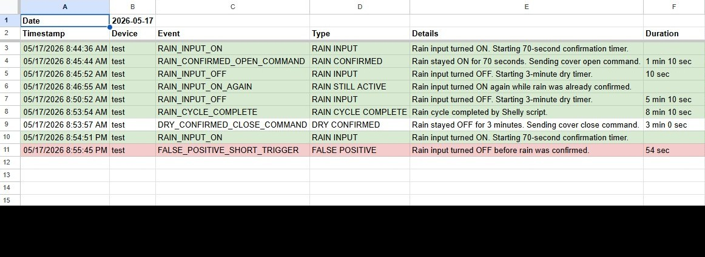
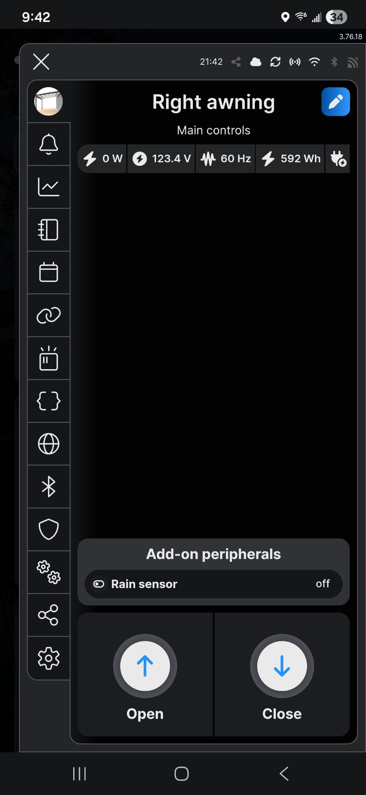
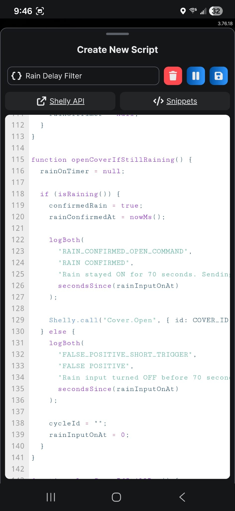
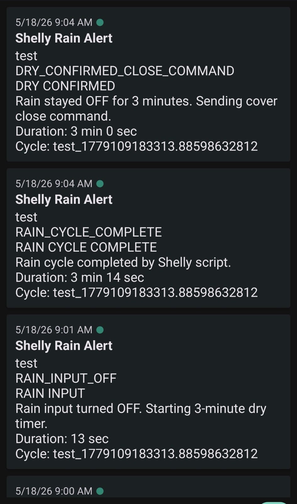

# Smart Rain-Aware Awning Protection with Shelly

This project uses a Shelly Plus 2PM, Shelly Plus Add-on, and Hydreon RG-9 rain sensor to protect an outdoor awning/cover from rain while filtering out false positive rain triggers.

The system does three things:

- Confirms rain before moving the cover
- Logs every decision to Google Sheets
- Sends matching phone notifications through ntfy

It was built for the Shelly Smart Home Challenge 2026 in the **Scripting & Logic** category.

## The Problem

A rain sensor can occasionally report rain on sunny days because of moisture, condensation, optical reflections, power noise, or tiny water events. If the cover reacts immediately, a false trigger can move the awning when it should not.

The goal was to keep automatic rain protection, but make it smarter:

- Ignore short false triggers
- Open the cover only after rain is confirmed
- Wait before closing after the sensor reports dry
- Keep a complete log for troubleshooting
- Send phone notifications for every automation decision

## Hardware

- Shelly Plus 2PM controlling the awning/cover motor
- Shelly Plus Add-on reading the rain sensor output
- Hydreon RG-9 rain sensor
- 12V or 24V DC supply for the RG-9
- Optional 12V sealed lead-acid battery for clean-power testing
- Phone with ntfy app installed
- Google Sheet with Apps Script web app

## Wiring Overview

The RG-9 is powered through its normal J1 connector.

```text
DC supply +  -> RG-9 J1 V+
DC supply -  -> RG-9 J1 GND
RG-9 GND     -> Shelly/Add-on GND/common
RG-9 OUT     -> Shelly/Add-on digital input
```

The RG-9 output is open collector. Do not feed supply voltage directly into the Shelly input.

In this setup:

```text
Shelly input ON  = rain
Shelly input OFF = dry
```

## Logic

The Shelly script is the brain of the automation.

```text
Rain input ON
-> start 70-second confirmation timer
-> if input is still ON after 70 seconds, open cover
-> if input turns OFF before 70 seconds, log false positive

Rain input OFF after confirmed rain
-> start 3-minute dry timer
-> if input is still OFF after 3 minutes, close cover
-> if rain returns before 3 minutes, keep cover open
```

The timings are easy to change:

```javascript
var RAIN_ON_DELAY_MS = 70000;
var RAIN_OFF_DELAY_MS = 180000;
```

## Logged Events

Example events sent to Google Sheets and ntfy:

```text
SCRIPT_STARTED
RAIN_INPUT_ON
FALSE_POSITIVE_SHORT_TRIGGER
RAIN_CONFIRMED_OPEN_COMMAND
RAIN_INPUT_OFF
DRY_CONFIRMED_CLOSE_COMMAND
RAIN_RETURNED_BEFORE_CLOSE
RAIN_CYCLE_COMPLETE
```

## Google Sheet Columns

The Apps Script creates a new sheet tab each day and logs:

```text
Timestamp
Device
Event
Type
Details
Duration
Cycle ID
Source
```

Each day gets its own tab:

```text
2026-05-18
2026-05-19
2026-05-20
```

## Notifications

The Shelly script sends each event directly to ntfy. Google Apps Script only writes to the sheet, so notifications do not slow down the sheet logger.

Example ntfy topic placeholder:

```text
YOUR_NTFY_TOPIC
```

## Files

- `shelly-rain-filter.js`: Shelly script for rain confirmation, dry confirmation, cover control, logging, and notifications
- `google-apps-script.js`: Google Apps Script web app that receives Shelly logs and writes them to daily sheet tabs
- `SUBMISSION_CHECKLIST.md`: checklist for preparing the final Shelly Challenge submission

## Photos

### Rain Sensor Mounted



Hydreon RG-9 rain sensor mounted above the awning/cover so the Shelly system can detect rain before moving the cover.

### Awning / Cover


Motorized outdoor awning/cover protected by the Shelly rain automation.

### Sensor Wiring



RG-9 J1 wiring detail showing the sensor powered through its normal input terminals.

### Wiring Diagram



Wiring diagram showing the RG-9 powered from a 12V DC supply, with shared ground and the RG-9 output connected to the Shelly Plus Add-on digital input.

## Screenshots

### Google Sheets Log



Daily Google Sheets log showing a confirmed rain cycle and a short false positive that was blocked by the 70-second confirmation timer.

### Shelly Device



Shelly device dashboard showing the awning controls and the Shelly Add-on rain sensor input state.

### Shelly Script Logic



Shelly script logic that waits 70 seconds, checks whether the rain input is still active, then either opens the cover or logs the event as a false positive.

### Phone Notifications



ntfy phone notifications generated directly by the Shelly script, matching the same events logged to Google Sheets.

## Setup

1. Create a Google Sheet.
2. Open **Extensions -> Apps Script**.
3. Paste the contents of `google-apps-script.js`.
4. Deploy as a web app:
   - Execute as: yourself
   - Access: anyone with the link
5. Copy the web app URL ending in `/exec`.
6. In `shelly-rain-filter.js`, replace:

```javascript
var DEVICE_NAME = "YOUR_DEVICE_NAME";
var GOOGLE_SCRIPT_URL = "YOUR_GOOGLE_SCRIPT_WEB_APP_URL";
var NTFY_TOPIC = "YOUR_NTFY_TOPIC";
```

7. In the Shelly device, go to **Scripts**, create a new script, and paste the updated Shelly script.
8. Disable any old immediate actions that open/close the cover directly from the rain input.
9. Start the Shelly script.
10. Test with a short rain trigger. It should log `FALSE_POSITIVE_SHORT_TRIGGER` and should not move the cover.
11. Test with a sustained rain trigger. After 70 seconds, it should open the cover and log `RAIN_CONFIRMED_OPEN_COMMAND`.

## Demo Story

The demo shows:

1. A short false trigger is ignored.
2. A sustained rain signal opens the cover after confirmation.
3. A dry signal closes the cover after a 3-minute delay.
4. Google Sheets receives every decision.
5. ntfy sends matching phone notifications.

## Privacy Notes

Before publishing this project, replace all private values:

```text
YOUR_GOOGLE_SCRIPT_WEB_APP_URL
YOUR_NTFY_TOPIC
YOUR_DEVICE_NAME
```

Do not publish real addresses, private webhook URLs, or personal notification topics.
